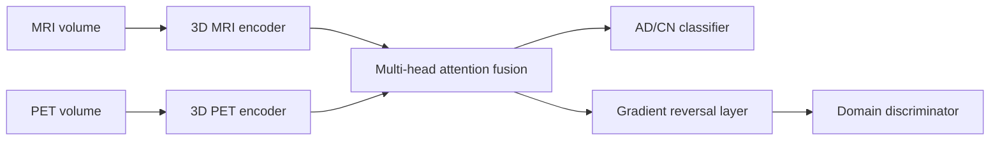
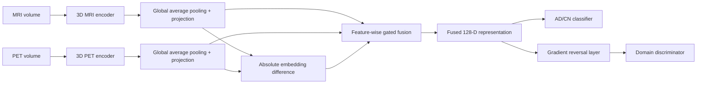

# Lightweight Gated MRI–PET Fusion for Unsupervised Domain Adaptation in Alzheimer’s Disease Classification

This repository contains the implementation used for the ICONIP 2026 research project:

> **Lightweight Gated MRI–PET Fusion for Unsupervised Domain Adaptation in Alzheimer’s Disease Classification**

**Authors:** Syed Muhammad Abdullah, Shahab Ud Din, Muhammad Haroon Shakeel, and Murtaza Taj

The project studies cross-domain **Alzheimer’s disease (AD) versus cognitively normal (CN)** classification using paired structural MRI and PET scans from **ADNI1** and **ADNI2**. The central goal is to improve generalization when the cohort used for testing differs from the cohort used for supervised training.

The repository contains the paper’s attention-based MM-DDA baseline and the proposed lightweight gated-fusion model. The proposed method replaces multi-head attention with adaptive feature-wise MRI–PET gating while retaining unsupervised adversarial domain adaptation.

> **Research-use disclaimer:** This code is intended for research and educational use only. It is not a medical device and must not be used for clinical diagnosis or treatment decisions.

---

## Repository Contents

```text
.
├── Ablation 1.ipynb
├── Ablation 2.ipynb
├── Ablation 3.ipynb
├── Baseline.ipynb
├── DAAN_ADNI_Notebook.ipynb
├── Dataset.zip
├── ICONIP_2026_paper_1176.pdf
├── Proposed Model.ipynb
└── README.md
```

| File | Description |
|---|---|
| `Ablation 1.ipynb` | First ablation experiment used to evaluate an individual model configuration from the paper’s ablation study. |
| `Ablation 2.ipynb` | Second ablation experiment used to isolate the effect of selected components of the proposed framework. |
| `Ablation 3.ipynb` | Third ablation experiment used to complete the component-wise comparison reported in the paper. |
| `Baseline.ipynb` | MM-DDA-style baseline with dual 3D CNN encoders, multi-head attention fusion, MRI–PET correlation losses, source–target feature consistency, and adversarial domain adaptation. |
| `DAAN_ADNI_Notebook.ipynb` | ADNI MRI–PET implementation of the Dynamic Adversarial Adaptation Network (DAAN) comparison model, including global and class-wise local domain discriminators with dynamically weighted adversarial adaptation. |
| `Dataset.zip` | Repository dataset package containing the metadata and supporting data files required by the notebooks. |
| `ICONIP_2026_paper_1176.pdf` | The ICONIP 2026 research paper describing the problem, proposed method, experiments, and results. |
| `Proposed Model.ipynb` | Implementation of the paper’s proposed lightweight gated MRI–PET fusion model with weighted focal loss, modality alignment, and adversarial domain adaptation. |
| `README.md` | Project overview, methodology, experimental protocol, results, and reproduction guidance. |

---

## Research Problem

MRI and PET provide complementary information:

- **MRI** captures structural brain characteristics.
- **PET** captures metabolic or functional information.

A model trained on one ADNI cohort may not generalize reliably to another because of changes in acquisition protocols, scanners, preprocessing, and participant distributions. The project evaluates two unsupervised domain-adaptation settings:

```text
ADNI1 → ADNI2
ADNI2 → ADNI1
```

For each direction:

- the first cohort is the **labeled source domain**;
- the second cohort is the **unlabeled target domain** during adaptation;
- target diagnostic labels are never used for model training;
- target labels are used only for final evaluation.

The task is binary classification:

| Label | Meaning |
|---|---|
| `0` | CN — Cognitively Normal |
| `1` | AD — Alzheimer’s Disease |

Mild cognitive impairment cases are excluded from the main experiments.

---

## Dataset Construction

MRI and PET metadata are processed separately for ADNI1 and ADNI2. Pairing is performed at the subject level.

For each subject, the pipeline:

1. keeps only AD and CN records;
2. requires the MRI and PET diagnostic labels to agree;
3. considers available MRI–PET acquisition combinations;
4. selects the combination with the smallest absolute acquisition-date difference;
5. accepts the pair only when the date gap is no more than **180 days**;
6. retains no more than one MRI–PET pair per subject;
7. removes unreadable, missing, corrupted, or unprocessable scans before splitting.

Train, validation, and test partitions are created only after the final readable paired dataset has been constructed. Splitting is subject-wise and stratified, so the same participant cannot occur in more than one partition.

### Final Usable Paired Dataset

| Domain | Usable pairs | Train | Validation | Test |
|---|---:|---:|---:|---:|
| ADNI1 | 58 | 22 | 18 | 18 |
| ADNI2 | 249 | 99 | 75 | 75 |

The resulting split is approximately **40% training, 30% validation, and 30% testing**.

Only the target-domain **training split** is used as unlabeled data during adversarial adaptation. Target validation and test scans do not update the feature encoders, fusion module, classifier, or domain discriminator.

---

## Expected Metadata Files

The notebooks currently expect the following CSV filenames:

```text
improvement2_adni1_mri_5_05_2026.csv
improvement2_adni1_pet_5_05_2026.csv
improvement2_adni2_mri_5_05_2026.csv
improvement2_adni2_pet_5_05_2026.csv
```

Each CSV should contain the ADNI metadata fields used by the notebooks, including subject identifier, diagnostic group, image identifier, visit, modality, acquisition date, and scan description.

The notebooks contain Kaggle-specific path constants. Before running them in another environment, update:

```python
CSV_ROOT
THREE_DATA_ROOT
ADNI1_MRI_DATA_ROOT
WORK_BASE
```

The ADNI image data and metadata are not included in this repository. Researchers must obtain access through the Alzheimer’s Disease Neuroimaging Initiative and comply with its data-use requirements.

---

## Preprocessing

Both notebooks use the same final input size and the same core preprocessing protocol.

### Common Pipeline

1. Locate image folders or volume files using subject and image identifiers.
2. Load the scan as one 3D floating-point volume.
3. Replace NaN and infinite values with zero.
4. Clip intensities to the **0.5th–99.5th percentile** range.
5. Prefer already preprocessed or registered image candidates when available.
6. For raw images, apply approximate foreground cropping with a four-voxel margin.
7. Optionally apply light Gaussian smoothing with \(\sigma=1.0\).
8. Resample each volume to **113 × 137 × 113** using trilinear interpolation.
9. Apply modality-specific normalization.
10. Cache processed volumes as `.npy` files for later runs.

### MRI Normalization

MRI volumes are z-score normalized using a foreground estimate based on voxels above the 20th intensity percentile.

### PET Normalization

PET volumes are min–max normalized to the interval \([0,1]\). The pipeline does not compute SUV or SUVR values.

To improve consistency, ADNI1 PET entries whose descriptions contain `PIB`, `C11`, or `C-11` are excluded.

N4 bias-field correction is implemented as an optional preprocessing step but is disabled in the reported experiments.

---

## Baseline: MM-DDA-Style Attention Fusion

The baseline is based on the multimodal domain-adaptation approach of Fu et al. It contains:

- separate 3D CNN encoders for MRI and PET;
- multi-head attention for multimodal fusion;
- an AD/CN classifier;
- a domain discriminator;
- a gradient reversal layer for learning domain-invariant features.



### Baseline Training Objective

The baseline combines:

- source-domain classification loss;
- source MRI–PET correlation loss;
- target MRI–PET correlation loss;
- source–target fused-feature MSE consistency;
- adversarial domain-classification loss.

\[
\mathcal{L}_{base}
=
\mathcal{L}_{cls}
+
\mathcal{L}^{S}_{cor}
+
\mathcal{L}^{T}_{cor}
+
\mathcal{L}_{mse}
+
\mathcal{L}_{dom}
\]

Training is performed in two stages:

1. **Source-only supervised pretraining**
2. **Unsupervised source–target domain adaptation**

---

## Proposed Lightweight Gated MRI–PET Fusion

The proposed model replaces attention-based fusion with a smaller feature-wise gating mechanism.

MRI and PET volumes first pass through separate 3D CNN encoders. Global average pooling and projection layers produce 128-dimensional modality embeddings:

\[
z_m=g_m(f_m(x_{MRI})), \qquad
z_p=g_p(f_p(x_{PET}))
\]

The gate receives the MRI embedding, PET embedding, and their absolute difference:

\[
g=\sigma\left(\mathrm{MLP}\left([z_m,z_p,|z_m-z_p|]\right)\right)
\]

The fused representation is:

\[
z_f=g\odot z_m+(1-g)\odot z_p
\]

Here, \(g\in[0,1]^{128}\) is a feature-wise vector rather than one scalar for the whole patient:

- values closer to `1` give more weight to MRI;
- values closer to `0` give more weight to PET.



### Stage 1: Source-Only Supervised Training

Stage 1 uses labeled source-domain data to train the encoders, gating module, and AD/CN classifier.

The classification objective is a class-weighted focal loss:

\[
\mathcal{L}_{focal}
=
-\frac{1}{N}
\sum_{i=1}^{N}
w_{y_i}(1-p_{t,i})^{\gamma}\log(p_{t,i})
\]

A normalized MRI–PET alignment loss encourages paired modality embeddings to remain compatible:

\[
\mathcal{L}_{align}
=
\left\|
\frac{z_m}{\|z_m\|}
-
\frac{z_p}{\|z_p\|}
\right\|_2^2
\]

The Stage 1 objective is:

\[
\mathcal{L}_{stage1}
=
\mathcal{L}_{focal}
+
\lambda_{align}\mathcal{L}_{align}
\]

### Stage 2: Unsupervised Domain Adaptation

Stage 2 uses labeled source samples and unlabeled target samples.

The fused representations pass through a gradient reversal layer before the domain discriminator. The discriminator learns to distinguish source from target, while the reversed gradients encourage the encoders and fusion module to learn domain-invariant representations.

The complete objective is:

\[
\mathcal{L}_{stage2}
=
\mathcal{L}^{S}_{focal}
+
\lambda_{align}
\left(
\mathcal{L}^{S}_{align}
+
\mathcal{L}^{T}_{align}
\right)
+
\lambda_{dom}\mathcal{L}_{dom}
\]

Target diagnostic labels are not used in this objective.

---

## Main Experimental Settings

| Hyperparameter | Value |
|---|---:|
| Input shape | `113 × 137 × 113` |
| Random seed | `42` |
| Batch size | `1` |
| Optimizer | Adam |
| Learning rate | `9 × 10⁻⁷` |
| Dropout | `0.5` |
| Stage 1 epochs | `150` |
| Stage 2 epochs | `50` |
| Gate/embedding dimension | `128` |
| GRL coefficient | `0.1` |
| Domain-loss weight | `0.10` |
| Modality-alignment weight in notebook | `0.05` |
| Focal-loss gamma | `2.0` |
| Maximum MRI–PET date gap | `180 days` |
| Checkpoint selection | Source-validation AUC |

A GPU is strongly recommended because both modalities are processed as full 3D volumes.

---

## Results

The paper reports target-domain classification accuracy for both transfer directions.

| Transfer direction | DAAN | MM-DDA baseline | Proposed gated fusion |
|---|---:|---:|---:|
| ADNI1 → ADNI2 | 64.10% | 38.67% | **66.67%** |
| ADNI2 → ADNI1 | **59.09%** | 50.00% | 50.00% |

### Main Findings

- In the challenging **ADNI1 → ADNI2** setting, the proposed model improves accuracy by **28.00 percentage points** over MM-DDA.
- In the same direction, it exceeds DAAN by **2.57 percentage points**.
- In **ADNI2 → ADNI1**, the proposed model matches MM-DDA while using fewer trainable parameters.
- DAAN performs best in the reverse direction, but it is the largest of the three evaluated models.

### Trainable Parameters

| Model | Trainable parameters |
|---|---:|
| DAAN | 1,414,776 |
| MM-DDA | 1,229,428 |
| **Proposed gated-fusion model** | **1,032,052** |

The proposed model uses approximately:

- **16.1% fewer parameters than MM-DDA**
- **27.1% fewer parameters than DAAN**

---

## Ablation Study

| Model variant | ADNI1 → ADNI2 | ADNI2 → ADNI1 |
|---|---:|---:|
| CNN fusion baseline | 38.67% | 50.00% |
| Gated fusion only | 33.33% | 50.00% |
| Gated fusion + focal loss | 33.33% | 40.00% |
| **Full proposed model** | **66.67%** | **50.00%** |

The ablation results indicate that the gain in ADNI1 → ADNI2 does not come from gated fusion or focal loss alone. The strongest result is obtained when gated fusion, weighted focal loss, modality alignment, and adversarial domain adaptation are used together.

The reverse direction is less stable, most likely because ADNI1 contains only 18 target-test subjects.

---

## Running the Notebooks

### 1. Create or Select a GPU Environment

The notebooks were prepared for Kaggle and install the required medical-imaging packages in the first cell.

Core dependencies include:

```text
Python
PyTorch
NumPy
pandas
scikit-learn
tqdm
nibabel
pydicom
SimpleITK
```

### 2. Mount the Data

Add the four metadata CSVs and the corresponding ADNI1/ADNI2 MRI and PET folders to the environment.

### 3. Update Paths

Edit the path configuration near the beginning of each notebook so that it points to the mounted CSV and image directories.

### 4. Run the Baseline

Open `Baseline.ipynb` and execute the cells in order. The notebook:

- loads and validates the metadata;
- creates nearest MRI–PET pairs;
- indexes the scan folders;
- preprocesses and caches readable volumes;
- creates subject-wise splits;
- trains both transfer directions;
- reports source and target metrics;
- stores the best checkpoints.

### 5. Run the DAAN Comparison Model

Open `DAAN_ADNI_Notebook.ipynb` and execute the cells in order. The notebook adapts DAAN to the paired ADNI MRI–PET dataset and evaluates the same two transfer directions used by the baseline and proposed model:

```text
ADNI1 → ADNI2
ADNI2 → ADNI1
```

It retains DAAN’s global domain discriminator, class-wise local domain discriminators, gradient reversal mechanism, and dynamic weighting between global and local adaptation.

### 6. Run the Proposed Model

Open `Proposed Model.ipynb` and execute the cells in order. It reuses the same data construction and split protocol, then trains the lightweight gated-fusion model in both transfer directions.

The notebook also calculates supplementary implementation diagnostics such as sensitivity, specificity, balanced accuracy, AUC, F1, gate statistics, source-validation threshold tuning, and post-hoc prototype-distance reliability summaries. The paper’s primary comparison metric is target-domain accuracy.

---

### 7. Run the Ablation Notebooks

Run `Ablation 1.ipynb`, `Ablation 2.ipynb`, and `Ablation 3.ipynb` to reproduce the component-wise experiments summarized in the ablation study. These notebooks evaluate reduced or modified versions of the proposed framework so that the contribution of the model components can be compared under the same ADNI pairing, preprocessing, splitting, and transfer protocol.

---

## Generated Outputs

Depending on the notebook, outputs include:

- cached preprocessed `.npy` volumes;
- Stage 1 and Stage 2 model checkpoints;
- training-history tables;
- source-test, target-validation, and target-test metrics;
- tuned source-validation decision thresholds;
- gate statistics;
- optional prototype-reliability tables.

The output directories are controlled by `WORK_BASE`, `CACHE_ROOT`, and `CHECKPOINT_ROOT`.

---

## Reproducibility Notes

- Use the same random seed, pairing logic, readability filtering, preprocessing, and subject-wise splits for all compared models.
- Perform filtering before splitting; otherwise, unreadable scans can change the effective class distribution after the split.
- Never use target validation or test labels for training.
- Tune checkpoints and decision thresholds only with source-domain validation data.
- Do not compare results obtained from different paired datasets or different split protocols as though they were directly equivalent.
- Because the final ADNI1 sample is very small, results can be sensitive to data availability, preprocessing, and random initialization.

---

## Limitations and Future Work

The main limitation is the small number of readable paired MRI–PET subjects, especially in ADNI1. This makes the ADNI2 → ADNI1 setting unstable and limits the strength of conclusions that can be drawn from the reverse transfer experiment.

The experiments also cover only ADNI1 and ADNI2. Future work should evaluate the method on larger multimodal cohorts and external datasets such as AIBL or OASIS, and should investigate robustness across additional acquisition sites and preprocessing pipelines.

---

## Citation

For the ICONIP 2026 manuscript, use:

```bibtex
@inproceedings{abdullah2026lightweight,
  title     = {Lightweight Gated MRI--PET Fusion for Unsupervised Domain Adaptation in Alzheimer's Disease Classification},
  author    = {Abdullah, Syed Muhammad and Din, Shahab Ud and Shakeel, Muhammad Haroon and Taj, Murtaza},
  booktitle = {International Conference on Neural Information Processing},
  year      = {2026},
  note      = {ICONIP 2026 manuscript}
}
```

---

## Key References

1. Alzheimer’s Disease Neuroimaging Initiative (ADNI): https://ida.loni.usc.edu  
2. Fu, B., Shen, C., Liao, S., Wu, F., and Liao, B. “Prediction of Alzheimer’s Disease Based on Multi-Modal Domain Adaptation.” *Brain Sciences*, 15(6), 618, 2025. https://doi.org/10.3390/brainsci15060618  
3. Ganin, Y. et al. “Domain-Adversarial Training of Neural Networks.” *Journal of Machine Learning Research*, 17(59), 1–35, 2016.  
4. Lin, T.-Y. et al. “Focal Loss for Dense Object Detection.” *ICCV*, 2017.  
5. Yu, C., Wang, J., Chen, Y., and Huang, M. “Transfer Learning with Dynamic Adversarial Adaptation Network.” *ICDM*, 2019. https://doi.org/10.1109/ICDM.2019.00088
