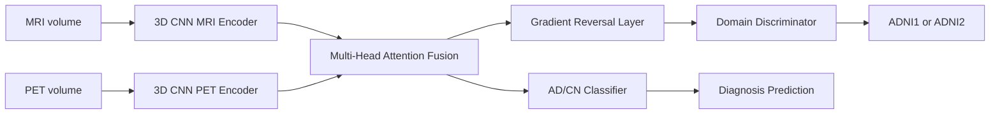
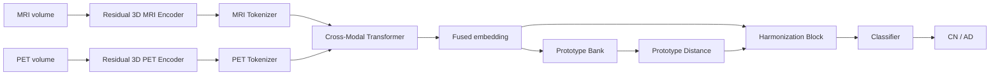
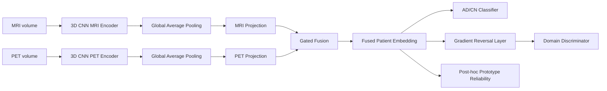

# MRI–PET Domain Robustness for Alzheimer’s Classification

This repository contains the final deep learning project notebooks for Alzheimer’s disease classification using paired MRI and PET scans. The project focuses on **out-of-distribution (OOD) robustness** between ADNI cohorts, specifically transfer from **ADNI1 → ADNI2** and **ADNI2 → ADNI1**.

The main task implemented in the final notebooks is binary classification:

- **CN**: Cognitively Normal
- **AD**: Alzheimer’s Disease

The project started from a Fu et al.-style multi-modal domain adaptation baseline and then explored two improvements designed to make the model more robust under cohort/domain shift.

---

## 1. Project Motivation

Alzheimer’s disease models often perform well when training and testing data come from the same distribution, but performance can drop when the test data comes from a different cohort, scanner protocol, acquisition setting, or dataset version.

This project studies that problem through a practical transfer setting:

```text
Train on ADNI1  →  Test on ADNI2
Train on ADNI2  →  Test on ADNI1
```

MRI and PET provide complementary information:

- **MRI** captures structural brain changes such as atrophy.
- **PET** captures functional/metabolic information.

The core research question is:

> Can a multi-modal MRI–PET model become more robust when transferred between ADNI1 and ADNI2, especially under limited paired data?

---

## 2. Repository Contents

```text
.
├── Baseline.ipynb
├── Improvement 1.ipynb
├── Improvement 2.ipynb
└── README.md
```

### Notebook summary

| Notebook | Purpose |
|---|---|
| `Baseline.ipynb` | Reimplementation/adaptation of a Fu et al.-style Multi-Modal Deep Domain Adaptation model. |
| `Improvement 1.ipynb` | Adds a cross-modal Transformer, prototype-based OOD evidence, and harmonization. |
| `Improvement 2.ipynb` | Simplifies the model using lightweight gated MRI–PET fusion, anti-collapse training, threshold tuning, and reliability analysis. |

---

## 3. Dataset

The notebooks use ADNI MRI and PET data with CSV metadata tables for ADNI1 and ADNI2.

Expected CSV files:

```text
improvement2_adni1_mri_5_05_2026.csv
improvement2_adni1_pet_5_05_2026.csv
improvement2_adni2_mri_5_05_2026.csv
improvement2_adni2_pet_5_05_2026.csv
```

The notebooks pair MRI and PET scans by:

1. Matching the same subject.
2. Keeping only AD/CN labels.
3. Ensuring MRI and PET labels agree.
4. Selecting the nearest MRI–PET scan pair by acquisition date.
5. Dropping pairs where the scan gap is greater than 180 days.
6. Filtering unreadable scans before train/validation/test splitting.

### Final usable sample sizes

After readability filtering in the final baseline and Improvement 2 pipeline:

| Cohort | Usable paired subjects | Train | Validation | Test |
|---|---:|---:|---:|---:|
| ADNI1 | 58 | 22 | 18 | 18 |
| ADNI2 | 249 | 99 | 75 | 75 |

This is an important limitation: ADNI1 has very few usable paired MRI–PET subjects, so ADNI1 → ADNI2 transfer is highly data-limited.

---

## 4. Preprocessing Pipeline

The notebooks implement a robust 3D medical image loading and preprocessing pipeline.

Main steps:

1. Locate MRI/PET image files using subject IDs and image IDs.
2. Load supported medical image formats using `nibabel`, `pydicom`, and `SimpleITK`.
3. Convert images to 3D floating-point volumes.
4. Replace NaN or infinite values.
5. Clip extreme intensity values.
6. Crop approximate foreground regions.
7. Resize volumes to a fixed target shape.
8. Normalize MRI and PET differently.
9. Cache processed `.npy` volumes to speed up future runs.

Target shapes:

| Notebook | Target shape |
|---|---|
| Baseline | `(113, 137, 113)` |
| Improvement 1 | `(96, 112, 96)` |
| Improvement 2 | `(113, 137, 113)` |

---

## 5. Baseline: Fu-Style Multi-Modal Deep Domain Adaptation

The baseline is inspired by the MM-DDA idea from Fu et al. It uses MRI and PET together and tries to reduce the domain gap between ADNI1 and ADNI2.

### Baseline architecture



### Baseline components

- **MRI encoder**: 3D CNN feature extractor.
- **PET encoder**: 3D CNN feature extractor.
- **Multi-head attention fusion**: combines MRI and PET features.
- **Classifier head**: predicts CN vs AD.
- **Domain discriminator**: predicts whether features come from ADNI1 or ADNI2.
- **Gradient reversal layer**: encourages domain-invariant features.
- **Correlation loss**: encourages MRI and PET feature alignment.
- **MSE feature consistency loss**: encourages source and target features to be closer during adaptation.

### Training strategy

The baseline uses two training stages:

1. **Stage 1: Source-only pretraining**
   - Train on labeled source domain.
   - Optimize classification and MRI–PET correlation.

2. **Stage 2: Domain adaptation**
   - Train using source and target batches.
   - Source labels are used for classification.
   - Source and target features are aligned through domain adversarial learning.

---

## 6. Improvement 1: Cross-Modal Transformer + Prototype Harmonization

Improvement 1 tested a more complex architecture designed to improve cross-modal reasoning and OOD robustness.

### Main changes

Compared with the baseline, Improvement 1 adds:

1. **Residual 3D encoders**
   - Stronger feature extractors than the baseline CNN blocks.

2. **3D tokenization**
   - MRI and PET feature maps are converted into token sequences.

3. **Cross-modal Transformer**
   - MRI and PET tokens are fused using Transformer self-attention.

4. **Prototype bank**
   - Stores class prototypes for CN and AD embeddings.
   - Computes distance from a sample embedding to the nearest class prototype.

5. **Harmonization block**
   - Uses prototype distance as a signal to adjust the fused representation.
   - The idea is that samples far from known source prototypes may need correction before classification.

6. **Consistency loss**
   - Applies strong MRI/PET augmentations and encourages the clean and augmented representations to remain close.

### Improvement 1 architecture



### Why this was useful

Improvement 1 was useful as a research experiment because it tested whether a richer Transformer-based multimodal representation could help under OOD shift.

### What happened in practice

The model remained unstable because the paired dataset was small, especially in ADNI1. In the final output, Improvement 1 still showed class-collapse behavior: it predicted only the CN class in both transfer directions.

This means Improvement 1 was architecturally interesting, but too complex for the available paired data and compute budget.

---

## 7. Improvement 2: Lightweight Gated Fusion + Anti-Collapse Training + Reliability Analysis

Improvement 2 was designed after observing that Improvement 1 was too heavy for the dataset size.

The main idea was:

> Use a simpler, more grounded model that directly targets class collapse and gives reliability evidence without adding an overly complex Transformer.

### Main changes

Improvement 2 adds:

1. **Lightweight gated MRI–PET fusion**
   - Replaces the heavy cross-modal Transformer.
   - Learns how much to rely on MRI vs PET for each sample.

2. **Class-balanced focal loss**
   - Helps reduce majority-class collapse.
   - Gives more weight to difficult or underrepresented examples.

3. **Validation threshold tuning**
   - Avoids blindly using a fixed threshold of 0.5.
   - Selects a threshold based on validation balanced accuracy.

4. **Post-hoc prototype reliability analysis**
   - Builds source-domain prototypes after training.
   - Measures confidence, gate values, and distance to class prototypes.
   - Provides reliability/OOD evidence without changing the training objective too much.

5. **Domain adversarial training retained**
   - Still uses a gradient reversal layer and domain discriminator to encourage ADNI-invariant features.

### Improvement 2 architecture



### Gated fusion intuition

The gate receives:

```text
MRI embedding
PET embedding
absolute difference between MRI and PET embeddings
```

It learns a value between 0 and 1:

```text
fused = gate × MRI_embedding + (1 - gate) × PET_embedding
```

So if the model believes MRI is more useful for a sample, the gate can give MRI more weight. If PET is more useful, it can shift weight toward PET.

---

## 8. Loss Functions

### Baseline losses

The baseline uses:

| Loss | Purpose |
|---|---|
| Classification loss | Learns CN vs AD prediction on labeled source data. |
| Correlation loss | Encourages MRI and PET features to be semantically aligned. |
| MSE consistency loss | Encourages source and target fused features to be close. |
| Domain adversarial loss | Encourages features that confuse the domain discriminator. |

### Improvement 1 losses

Improvement 1 uses:

| Loss | Purpose |
|---|---|
| Cross-entropy classification loss | Main CN/AD supervision. |
| Augmentation consistency loss | Makes clean and augmented embeddings similar. |
| Optional identity loss | Keeps harmonized embedding close to original embedding, if enabled. |

### Improvement 2 losses

Improvement 2 uses:

| Loss | Purpose |
|---|---|
| Weighted focal loss | Handles class imbalance and reduces collapse toward one class. |
| MRI–PET modality alignment loss | Keeps MRI and PET projected embeddings aligned. |
| Domain adversarial loss | Encourages source/target domain invariance. |

---

## 9. Evaluation Metrics

The notebooks report the following metrics:

| Metric | Meaning |
|---|---|
| ACC | Overall accuracy. |
| BAL_ACC / BACC | Balanced accuracy; average of sensitivity and specificity. |
| SEN | Sensitivity/recall for AD. Measures how many AD cases were correctly detected. |
| SPE | Specificity for CN. Measures how many CN cases were correctly detected. |
| AUC | Area under ROC curve. Measures ranking quality of predicted probabilities. |
| F1 | Harmonic mean of precision and recall for the AD class. |
| Confusion matrix | Shows true CN/AD vs predicted CN/AD counts. |

---

## 10. Final Target-Domain Test Results

### Target test results

| Model | Transfer direction | ACC | BAL_ACC / BACC | SEN | SPE | AUC | F1 | 
|---|---|---:|---:|---:|---:|---:|---:|
| Baseline | ADNI1 → ADNI2 | 38.67 | Not reported | 96.00 | 10.00 | 57.92 | 51.06 | 
| Baseline | ADNI2 → ADNI1 | 50.00 | Not reported | 0.00 | 100.00 | 61.73 | 0.00 | 
| Improvement 1 | ADNI1 → ADNI2 | 65.75 | 50.00 | 0.00 | 100.00 | 44.00 | 0.00 | 
| Improvement 1 | ADNI2 → ADNI1 | 55.56 | 50.00 | 0.00 | 100.00 | 25.00 | 0.00 | 
| Improvement 2 | ADNI1 → ADNI2 | 66.67 | 50.00 | 0.00 | 100.00 | 47.60 | 0.00 | 
| Improvement 2 | ADNI2 → ADNI1 | 50.00 | 50.00 | 55.56 | 44.44 | 55.56 | 52.63 | 

### Interpretation

As it can be seen that Improvement 2 has better accuracy in ADNI 1 -> ADNI 2 case than baseline and improvement 1, and in case of ADNI 2 -> ADNI 1 it is same as baseline but lower than improvement 1, but our improvement 2 model is less complex than baseline and improvement 1, so we are getting better in one case and same accuracy in one case through a less complex model.

---


## 12. Reproducibility Details

Common settings used in the final baseline and Improvement 2 notebooks:

| Setting | Value |
|---|---|
| Seed | 42 |
| Task | AD vs CN |
| MRI/PET pair gap | Maximum 180 days |
| Batch size | 1 |
| Learning rate | 9e-7 |
| Dropout | 0.5 |
| Stage 1 epochs | 150 |
| Stage 2 epochs | 50 |
| Domain adaptation | Gradient reversal layer |
| Source/target setup | ADNI1 ↔ ADNI2 |

Improvement 1 settings:

| Setting | Value |
|---|---|
| Target shape | `(96, 112, 96)` |
| Batch size | 2 |
| Embedding dimension | 256 |
| Token grid | `(4, 4, 4)` |
| Transformer heads | 4 |
| Transformer layers | 3 |
| Epochs | 30 |
| Learning rate | 1e-4 |
| Weight decay | 1e-4 |
| Early stopping patience | 8 |

---

